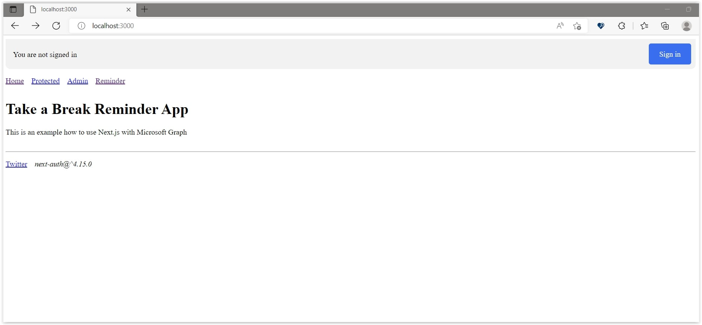
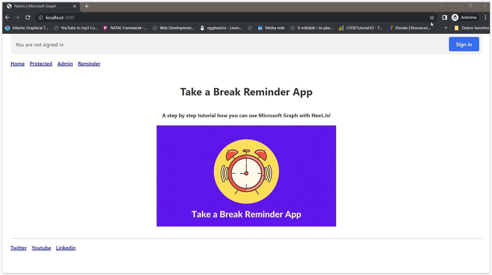

# Reminder App - step by step tutorial

*(colocar a foto da aplicação)*

Aqui nesse tutorial vamos aprender a como podemos usar Microsoft Graph integrado com Next.js

Mas primeiro precisamos entender antes o que é Microsoft Graph.

Microsoft Graph é uma API que permite que você acesse dados e serviços do Microsoft 365. Você pode usar a API do Microsoft Graph para construir aplicativos que interajam com milhões de usuários em todo o mundo, acessando dados de maneira consistente em todo o ecossistema do Microsoft 365.

*(escrever aqui sobre o Microsoft Graph - incluindo algumas imagens)*

Agora que já entendemos o que é o Microsoft Graph, vamos começar a criar nossa aplicação.

## Take a Break Reminder App. O que é? O que faz?

Essa aplicação é um lembrete de intervalos de tempo para você se levantar e fazer uma pausa. A aplicação irá te lembrar de fazer uma pausa a cada 60 minutos. O aplicativo irá mostrar uma notificação na tela do seu computador e também irá enviar um e-mail para você. 

*(explicar o que a aplicação faz)*

## Recursos usados

*(listar todos os recursos usados durante o desenvolvimento da aplicação)*

## Pré-requisitos

Antes de mais nada, antes de criar a nossa aplicação, precisaremos fazer algumas coisinhas antes. 

Uma delas é, criar uma conta no Microsoft 365 Developer Program. **[LINK AQUI](https://developer.microsoft.com/en-us/microsoft-365/dev-program)**. Não se preocupe. Essa conta é totalmente gratuita!

Se você tiver dúvidas em como criar a conta, você pode assistir esse vídeo **[AQUI](https://www.youtube.com/watch?v=JvWLgirC8xs)**. Pois explica direitinho como criar a conta.

## Criando a aplicação no Portal Azure

Agora precisamos seguir os seguintes passos para criar a aplicação no portal Azure.

*(colocar o passo a passo com imagens como criar a aplicação no Azure, incluso as environments da aplicação)*

Perfeito! Agora podemos começar a codar!

## Let's code!

Agora que criamos a nossa aplicação no portal Azure, vamos começar a codar. Nesse projeto utilizaremos o Next.js, então vamos começar instalando ele.

Para isso, vamos abrir o terminal e digitar o seguinte comando:


```bash
npx create-next-app reminder-app --typescript
```

Agora que já criamos o projeto, para saber que tudo está funcionando, vamos rodar o projeto com o seguinte comando:

```bash
cd reminder-app
```

```bash
npm run dev
```

Abre o browser e digite o seguinte endereço: http://localhost:3000 e pronto! Já temos o nosso projeto rodando.

Precisamos instalar algumas dependências para que possamos dar continuarmos com o nosso projeto. Um deles é o **[Microsoft Graph Client](https://learn.microsoft.com/en-us/graph/sdks/create-client?tabs=Javascript)**. Para instalar, vamos digitar o seguinte comando:

```bash
npm install @microsoft/microsoft-graph-client
```  

Se desejar conhecer mais sobre o Microsoft Graph Client, você pode acessar esse link **[AQUI](https://docs.microsoft.com/en-us/graph/sdks/sdks-overview)** e conhecer o NPM do Microsoft Graph Client **[AQUI](https://www.npmjs.com/package/@microsoft/microsoft-graph-client)**.

Outro pacote que precisaremos instalar é o NextAuth. Para instalar, vamos digitar o seguinte comando:

```bash
npm install next-auth
```

Também, se desejar saber mais sobre o NextAuth, você pode acessar esse link **[AQUI](https://next-auth.js.org/)** e conhecer o NPM do NextAuth **[AQUI](https://www.npmjs.com/package/next-auth)**.

Podemos agora começar a criar alguns componentes. 

## Criando alguns componentes na aplicação!

Vamos agora alterar um pouco a nossa aplicação. Não usaremos, nesse primeiro momento, nenhum UI Framework. Então vamos começar criando alguns componentes.

Toda aplicação precisa de um Layout. Então vamos criar um componente chamado Layout. Para isso, crie uma pasta chamada `components` e dentro dessa pasta, crie dois arquivos:

* `layout.tsx`

<details><summary><b>components/Layout/layout.tsx</b></summary>
<br/>

```tsx
/**
 * file: components/Layout/layout.tsx
 * description: file responsible for the 'Layout' component
 * data: 10/26/2022
 * author: Glaucia Lemos <Twitter: @glaucia_lemos86>
 */

import Header from '../Header/header';
import Footer from '../Footer/footer';
import React, { ReactNode } from 'react';

interface LayoutProps {
  children: ReactNode;
}

export default function Layout({ children }: LayoutProps) {
  return (
    <>
      <Header />
      <main>{children}</main>
      <Footer />
    </>
  );
}
```
</details>
<br/>

Calma! Ainda não acabou! Vamos criar mais um componente. Agora vamos criar o componente `Header` e crie os seguintes arquivos:

* `header.module.css`
* `header.tsx`

<details><summary><b>components/Header/header.module.css</b></summary>
<br/>

```css
.signedInStatus {
  display: block;
  min-height: 4rem;
  width: 100%;
}

.loading,
.loaded {
  position: relative;
  top: 0;
  opacity: 1;
  overflow: hidden;
  border-radius: 0 0 0.6rem 0.6rem;
  padding: 0.6rem 1rem;
  margin: 0;
  background-color: rgba(0, 0, 0, 0.05);
  transition: all 0.2s ease-in;
}

.loading {
  top: -2rem;
  opacity: 0;
}

.signedInText,
.notSignedInText {
  position: absolute;
  padding-top: 0.8rem;
  left: 1rem;
  right: 6.5rem;
  white-space: nowrap;
  text-overflow: ellipsis;
  overflow: hidden;
  display: inherit;
  z-index: 1;
  line-height: 1.3rem;
}

.signedInText {
  padding-top: 0rem;
  left: 4.6rem;
}

.avatar {
  border-radius: 2rem;
  float: left;
  height: 2.8rem;
  width: 2.8rem;
  background-color: white;
  background-size: cover;
  background-repeat: no-repeat;
}

.button,
.buttonPrimary {
  float: right;
  margin-right: -0.4rem;
  font-weight: 500;
  border-radius: 0.3rem;
  cursor: pointer;
  font-size: 1rem;
  line-height: 1.4rem;
  padding: 0.7rem 0.8rem;
  position: relative;
  z-index: 10;
  background-color: transparent;
  color: #555;
}

.buttonPrimary {
  background-color: #346df1;
  border-color: #346df1;
  color: #fff;
  text-decoration: none;
  padding: 0.7rem 1.4rem;
}

.buttonPrimary:hover {
  box-shadow: inset 0 0 5rem rgba(0, 0, 0, 0.2);
}

.navItems {
  margin-bottom: 2rem;
  padding: 0;
  list-style: none;
}

.navItem {
  display: inline-block;
  margin-right: 1rem;
}
```
</details>
<br/>

Não vamos entrar em detalhes sobre o css.

Agora, vamos focar no arquivo `header.tsx`. Abra o arquivo `header.tsx` e coloque o seguinte código:

<details><summary><b>components/Header/header.tsx</b></summary>
<br/>

```tsx
/**
 * file: components/Header/header.tsx
 * description: file responsible for the 'Header' component
 * data: 10/26/2022
 * author: Glaucia Lemos <Twitter: @glaucia_lemos86>
 */

import Link from 'next/link';
import { signIn, signOut, useSession } from 'next-auth/react';
import styles from './header.module.css';

export default function Header() {
  const { data: session, status } = useSession();
  const loading = status === 'loading';

  return (
    <header>
      <noscript>
        <style>{`.nojs-show { opacity: 1; top: 0; }`}</style>
      </noscript>
      <div className={styles.signedInStatus}>
        <p
          className={`nojs-show ${
            !session && loading ? styles.loading : styles.loaded
          }`}
        >
          {!session && (
            <>
              <span className={styles.notSignedInText}>
                You are not signed in
              </span>
              <a
                href={`/api/auth/signin`}
                className={styles.buttonPrimary}
                onClick={(e) => {
                  e.preventDefault();
                  signIn();
                }}
              >
                Sign in
              </a>
            </>
          )}
          {session?.user && (
            <>
              {session.user.image && (
                <span
                  style={{ backgroundImage: `url('${session.user.image}')` }}
                  className={styles.avatar}
                ></span>
              )}
              <span className={styles.signedInText}>
                <small>Signed in as</small>
                <br />
                <strong>{session.user.email ?? session.user.name}</strong>
              </span>
              <a
                href={`/api/auth/signout`}
                className={styles.button}
                onClick={(e) => {
                  e.preventDefault();
                  signOut();
                }}
              >
                {' '}
                Sign Out
              </a>
            </>
          )}
        </p>
      </div>
      <nav>
        <ul className={styles.navItems}>
          <li className={styles.navItem}>
            <Link href='/'>Home</Link>
          </li>
          <li className={styles.navItem}>
            <Link href='/protected'>Protected</Link>
          </li>
          <li className={styles.navItem}>
            <Link href='/admin'>Admin</Link>
          </li>
          <li className={styles.navItem}>
            <Link href='/reminder'>Reminder</Link>
          </li>
        </ul>
      </nav>
    </header>
  );
}
```
</details>
<br/>

Se você olhar o código acima, você verá que estamos usando o `useSession` do `next-auth/react` para obter os dados da sessão do usuário. E também estamos usando o `status` para verificar se a sessão está carregando ou não. 

Você verá que estamos usando o `session?.user` para verificar se o usuário está logado ou não. Se o usuário estiver logado, então mostraremos o nome e o e-mail do usuário. E também, se o usuário estiver logado, então mostraremos o botão `Sign Out` para que o usuário possa sair da aplicação.

Já na parte do bloco do código dentro do `return` estamos usando react. E também estamos usando o `Link` do `next/link` para navegar entre as páginas da aplicação. 

E, finalmente vamos criar o Footer component. 
Novamente, dentro da pasta `components` crie uma pasta chamada `Footer` e dentro dela crie os arquivos:

- `footer.module.css`

<details><summary><b>components/Footer/footer.module.css</b></summary>
<br/>

```css
.footer {
  margin-top: 2rem;
}

.navItems {
  margin-bottom: 1rem;
  padding: 0;
  list-style: none;
}

.navItem {
  display: inline-block;
  margin-right: 1rem;
}
```

</details>
<br/>

- `footer.tsx`

<details><summary><b>components/Footer/footer.tsx</b></summary>
<br/>

```tsx
import styles from '../Footer/footer.module.css';

export default function Footer() {
  return (
    <footer className={styles.footer}>
      <hr />
      <ul className={styles.navItems}>
        <li className={styles.navItem}>
          <a href='https://twitter.com/glaucia_lemos86'>Twitter</a>
        </li>
        <li className={styles.navItem}>
          <a href='https://twitter.com/glaucia_lemos86'>Youtube</a>
        </li>
        <li className={styles.navItem}>
          <a href='https://twitter.com/glaucia_lemos86'>Linkedin</a>
        </li>
      </ul>
    </footer>
  );
}
```

</details>
<br/>

É um Footer bem simples. Mas, se você quiser, pode adicionar mais coisas.

Mas, se o usuário não estiver logado? Então, o que acontece? Temos que criar uma página que diga que o usuário não tem permissão para acessar a página. Vamos fazer isso agora? 

Dentro da pasta `components` crie uma pasta chamada `AccessDenied` e dentro dela o arquivo:

- `access-denied.tsx`

<details><summary><b>components/AccessDenied/access-denied.tsx</b></summary>
<br/>

```tsx
/**
 * file: components/AccessDenied/access-denied.tsx
 * description: file responsible for the 'AccessDenied' component.
 * data: 10/26/2022
 * author: Glaucia Lemos <Twitter: @glaucia_lemos86>
 */

import { signIn } from 'next-auth/react';

export default function AccessDenied() {
  return (
    <>
      <h1>Access Denied</h1>
      <p>
        <a
          href='/api/auth/signin'
          onClick={(e) => {
            e.preventDefault();
            signIn();
          }}
        >
          You must be signed in to view this page
        </a>
      </p>
    </>
  );
}
```

</details>
<br/>

Novamente! É um componente muito simples. Uma vez que concluirmos todo esse tutorial, iremos incluir UIs mais bonitas, usando o Material UI.

Como estamos usando TypeScript nessa aplicação, precisamos transpilar o código. Para isso, execute o comando abaixo:

```bash
npm run build
```

E, por fim, vamos iniciar a aplicação. Para isso, execute o comando abaixo:

```bash
npm run dev
```

Você verá que a tela continua a mesma. Mas, por que? Porque ainda não criamos as páginas da aplicação. Vamos fazer isso agora?

# Definindo AAD Provider no NextAuth

Antes de darmos continuidade, precisamos configurar o AAD Provider no NextAuth. Para isso, dentro da pasta `pages/api` crie uma pasta chamada `auth`. E, dentro dessa pasta crie o arquivo `[...nextauth].ts` e adicione o seguinte código:

* `pages/api/auth/[...nextauth].ts`

<details><summary><b>pages/api/auth/[...nextauth].ts</b></summary>
<br/>

```tsx
/**
 * file: pages/api/auth/[...nextauth].ts
 * description: file responsible for the authenticate an user using AAD Provider
 * data: 10/28/2022
 * author: Glaucia Lemos <Twitter: @glaucia_lemos86>
 */

import NextAuth, { NextAuthOptions } from "next-auth";
import AzureADProvider from 'next-auth/providers/azure-ad';

export const authOptions: NextAuthOptions = {
  providers: [
    AzureADProvider({
      clientId: process.env.AZURE_CLIENT_ID,
      clientSecret: process.env.AZURE_CLIENT_SECRET,
      tenantId: process.env.AZURE_TENANT_ID,
    })
  ]
}

export default NextAuth(authOptions);
```

</details>
<br/>

Agora é o momento que temos que pegar as variáveis de ambiente que criamos no Azure AD anteriormente. Para isso, vamos criar um arquivo chamado `.env.local` na raiz do projeto. E vamos adicionar as seguintes variáveis de ambiente:

* `.env.local`

```text
AZURE_AD_CLIENT_ID=xxxxxxxx-xxxx-xxxx-xxxx-xxxxxxxxxxxx
AZURE_AD_CLIENT_SECRET=xxxxxxxxxxxxxxxxxxxxxxxxxxxxxxxxxxxxxxxxxxxx
AZURE_AD_TENANT_ID=xxxxxxxx-xxxx-xxxx-xxxx-xxxxxxxxxxxx
NEXTAUTH_URL=http://localhost:3000
NEXTAUTH_SECRET=123
```

Se desejar, eu criei um arquivo chamado `.env.local.example` que você pode usar como referência para criar o seu arquivo `.env.local`.

Agora precisamos configurar o arquivo principal da aplicação. Abre o arquivo `pages/_app.tsx` e adicione o seguinte código:

* `pages/_app.tsx`

<details><summary><b>pages/_app.tsx</b></summary>
<br/>

```tsx
/**
 * file: pages/_app.tsx
 * description: file responsible for the application's configuration
 * data: 10/26/2022
 * author: Glaucia Lemos <Twitter: @glaucia_lemos86>
 */

import { SessionProvider } from 'next-auth/react';

import type { AppProps } from 'next/app';
import type { Session } from 'next-auth';

export default function App({
  Component,
  pageProps: { session, ...pageProps },
}: AppProps<{ session: Session }>) {
  return (
    <SessionProvider session={session}>
      <Component {...pageProps} />
    </SessionProvider>
  );
}
```

</details>
<br/>

Estamos aqui definindo o `SessionProvider` do NextAuth. Ele é responsável por fornecer o estado da sessão para todos os componentes da aplicação.

Agora, execute a aplicação novamente e logo em seguida abre o browser em `http://localhost:3000`. Se a sua tela estiver parecida com a imagem abaixo, significa que tudo está funcionando corretamente:



Os links das páginas ainda não estão funcionando. Vamos fazer isso agora?

## Criando as páginas da aplicação

Agora, vamos criar as páginas da aplicação. Para isso, dentro da pasta `pages` crie os arquivos:

- `styles.css`
- `protected.tsx`
- `admin.tsx`
- `reminder.tsx`

E para melhorar um pouco o css da aplicação, vamos adicionar o seguinte código no arquivo `styles.css`:

* `styles.css`

<details><summary><b>styles.css</b></summary>
<br/>

```css
body {
  font-family: ui-sans-serif, system-ui, -apple-system, BlinkMacSystemFont,
    'Segoe UI', Roboto, 'Helvetica Neue', Arial, 'Noto Sans', sans-serif,
    'Apple Color Emoji', 'Segoe UI Emoji', 'Segoe UI Symbol', 'Noto Color Emoji';
  padding: 0 1rem 1rem 1rem;
  max-width: 100%;
  height: auto;
  margin: 0 auto;
  background: #fff;
  color: #333;
}

li,
p {
  line-height: 1.5rem;
}

a {
  font-weight: 500;
}

hr {
  border: 1px solid #ddd;
}

iframe {
  background: #ccc;
  border: 1px solid #ccc;
  height: 10rem;
  width: 100%;
  border-radius: 0.5rem;
  filter: invert(1);
}
```

</details>
<br/>

Retorne ao arquivo `pages/_app.tsx` e importe o estilo que acabamos de criar:

* `pages/_app.tsx`

<details><summary><b>pages/_app.tsx</b></summary>
<br/>

```tsx
import './styles.css';

(... some code here ...)
```

</details>
<br/>

Crie agora uma pasta chamada `styles` na raiz do projeto e dentro dela crie um arquivo chamado `Home.module.css`. E adicione o seguinte código:

* `styles/Home.module.css`

<details><summary><b>styles/Home.module.css</b></summary>
<br/>

```css
.container {
  min-height: 50vh;
  display: flex;
  flex-direction: column;
  justify-content: center;
  align-items: center;
}

.main {
  flex: 1;
  display: flex;
  flex-direction: column;
  justify-content: center;
  align-items: center;
}

.title {
  margin: 5% 0;
  line-height: 1.15;
  font-size: 2rem;
  margin-bottom: 2rem;
  text-align: center;
}
```

</details>
<br/>

Eu criei uma imagem que vocês podem pegar no repositorio do projeto e adicionar na pasta `public` (na raiz do projeto). O nome do arquivo da imagem é: `reminder.gif`.

Vamos agora começar a desenvolver a página do Admin. Para isso, vamos adicionar o seguinte código no arquivo `admin.tsx`:

* `pages/admin.tsx`

<details><summary><b>pages/admin.tsx</b></summary>
<br/>

```tsx
/**
 * file: pages/admin.tsx
 * description: file responsible for the admin page
 * data: 10/26/2022
 * author: Glaucia Lemos <Twitter: @glaucia_lemos86>
 */

import { useSession } from 'next-auth/react';
import Layout from '../components/Layout/layout';

export default function Page() {
  const { data } = useSession();

  return (
    <Layout>
      <h1>Admin Page</h1>
      <p>Only admin users can see this page.</p>
      <pre>{JSON.stringify(data, null, 2)}</pre>
    </Layout>
  );
}
```

</details>
<br/>

E, vamos fazer a mesma coisa com a página `reminder.tsx`:

* `pages/reminder.tsx`

<details><summary><b>pages/reminder.tsx</b></summary>
<br/>

```tsx
/**
 * file: pages/reminder.tsx
 * description: file responsible for the reminder page
 * data: 10/26/2022
 * author: Glaucia Lemos <Twitter: @glaucia_lemos86>
 */

import Layout from '../components/Layout/layout';

export default function ReminderPage() {
  return (
    <Layout>
      <h1>Reminder Page</h1>
      <p>Only admin users can see this page.</p>
    </Layout>
  );
}
```

</details>
<br/>

Agora vamos alterar algumas coisas no arquivo `index.tsx`. Vamos adicionar o seguinte código:

* `pages/index.tsx`

<details><summary><b>pages/index.tsx</b></summary>
<br/>

```tsx
/**
 * file: pages/index.tsx
 * description: file responsible for the home page
 * data: 10/26/2022
 * author: Glaucia Lemos <Twitter: @glaucia_lemos86>
 */

import Head from 'next/head';
import Layout from '../components/Layout/layout';
import Image from 'next/image';
import reminderImage from '../public/images/reminder.gif';
import styles from '../styles/Home.module.css';

export default function IndexPage() {
  return (
    <Layout>
      <div className={styles.container}>
        <Head>
          <title>NextJs | Microsoft Graph</title>
        </Head>
        <main className={styles.main}>
          <h1>Take a Break Reminder App</h1>
          <h4>
            A step by step tutorial how you can use Microsoft Graph with
            Next.Js!
          </h4>
          <div>
            <Image
              priority={true}
              src={reminderImage}
              width={560}
              height={315}
              alt='a clock image with a reminder'
            />
          </div>
        </main>
      </div>
    </Layout>
  );
}
```

</details>
<br/>

Wow! Quantas alterações, não é mesmo? Mas, vamos entender um pouco o que aconteceu aqui. Primeiro, importamos o componente `Head` do `next/head` e o componente `Image` do `next/image`. Depois, importamos a imagem que adicionamos na pasta `public` e, por fim, importamos o arquivo `Home.module.css` que criamos na pasta `styles`. 

Agora execute a aplicação e abre o navegador e acesse a página `http://localhost:3000/` e veja o resultado:




